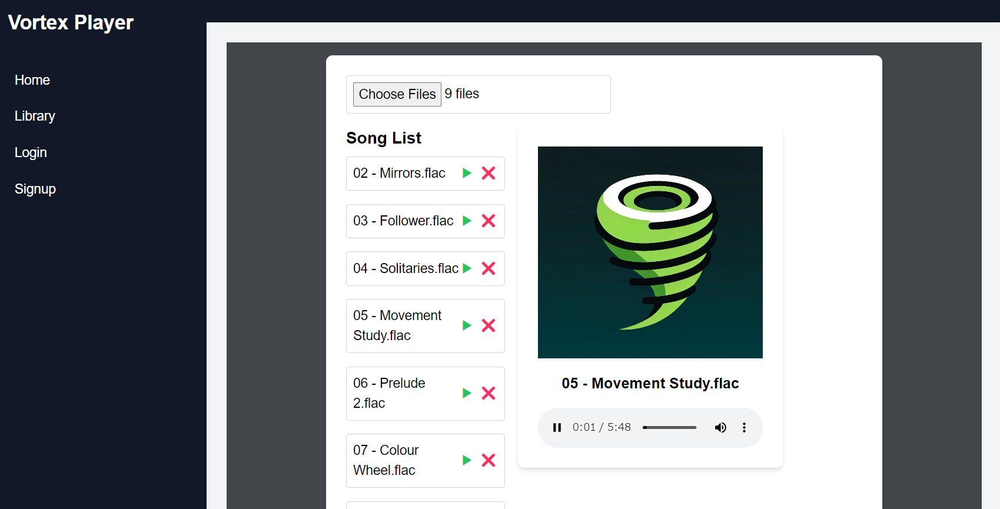

<div align="center">
  
</div>

# Vortex Music Player

Vortex Music Player is a sleek and modern web application that allows users to play music files from their local files and maintain a library of their local music files. The application supports all common music file types and uses a backend database to store local file information for each user. The project follows modern security best practices for user authentication and data management.


## Features

- **Music Playback**: Play music files directly from the application.
- **Responsive Design**: Optimized for both desktop and mobile devices.
- **Modern UI**: Sleek and user-friendly interface similar to Spotify.
- **To be implemented**: Music Library Management, User Authentication

## Technologies Used

- **Frontend**: React, Tailwind CSS, Axios
- **Backend**: Node.js, Express.js, Mongoose
- **Database**: MongoDB
- **Authentication**: JWT (JSON Web Tokens)
- **File Upload**: Multer
- **Others**: CORS, bcryptjs

## Prerequisites

- Node.js (v14 or higher)
- MongoDB (local or Atlas)
- npm (Node Package Manager)

## Installation

### Clone the Repository

```bash
git clone https://github.com/kidewi/vortex-player.git
cd vortex-player
```

### Backend Setup

1. **Navigate to the Backend Directory:**

   ```bash
   cd backend
   ```

2. **Install Dependencies:**

   ```bash
   npm install
   ```

3. **Create a `.env` File:**

   Create a `.env` file in the backend directory and add the following environment variables:

   ```plaintext
   MONGO_URI=mongodb+srv://<username>:<password>@cluster0.mongodb.net/vortex-player?retryWrites=true&w=majority
   JWT_SECRET=your_random_jwt_secret
   ```

4. **Start the Backend Server:**

   ```bash
   npm start
   ```

### Frontend Setup

1. **Navigate to the Frontend Directory:**

   ```bash
   cd ../frontend
   ```

2. **Install Dependencies:**

   ```bash
   npm install
   ```

3. **Start the Frontend Server:**

   ```bash
   npm start
   ```

## Usage

1. **Signup:**

   - Open your browser and navigate to `http://localhost:3000`.
   - Click on the Signup link.
   - Enter your desired username and password and submit the form.

2. **Login:**

   - After signing up, navigate to the Login link.
   - Enter your credentials and submit the form.

3. **Upload Music:**

   - Once logged in, navigate to the Music Library.
   - Click on the upload button to upload your local music files.

4. **Play Music:**

   - Your uploaded music files will be listed in the Music Library.
   - Click on any music file to start playback.

## Contributing

Contributions are welcome! Please fork the repository and create a pull request with your changes. Ensure that your code follows the project's coding standards and includes appropriate tests.

## Contact

For any inquiries or feedback, please contact [kirkdwilson@outlook.com](mailto:kirkdwilson@outlook.com).
